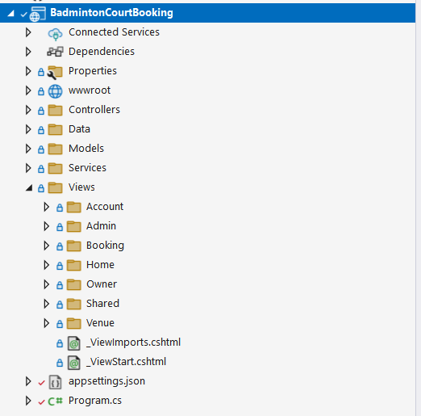

# Ke hoach hoan thien do an CourtBook

## 1. Muc tieu tong the

Hoan thien du an web dat san cau long bang ASP.NET Core MVC theo huong mot do an day du, co:
- phan tich nghiep vu ro rang;
- database that bang EF Core Code First;
- tao migration dau tien truoc khi `Update-Database`;
- dang nhap va phan quyen that;
- cac module Player / Owner / Admin hoan chinh;
- bo test va checklist kiem thu ro rang;
- tai lieu de demo va bao ve.

## 2. Hien trang du an

### Da co
- Giao dien MVC cho trang chu, tim san, chi tiet san, booking, owner dashboard, admin, login/register/profile.
- Du lieu mock giup xac dinh UX va flow tong quan.
- Nhieu man hinh co the tai su dung cho phien ban DB that.
- Da co `ApplicationDbContext`, entity `Venue/Court/Booking/UserSnapshot`, Fluent API va connection string SQL Server.
- Da co service layer cho `VenueCatalog`, `Booking`, `OwnerDashboard`, `AdminDashboard`.
- Da co migration dau tien `InitialCreate` trong thu muc `Migrations/`.
- Da tao DB `CourtBookDb` va seed demo data de giu duoc cac flow Phase 1-2.

### Chua co
- Chua co test project va test tu dong.
- `MockData` van con duoc dung de bootstrap du lieu demo va ho tro mot so helper hien thi.

### Ket luan
Du an da xong Phase 3 theo huong auth/authorization that + profile doc/ghi DB. Nen tang DB/service layer va bao ve route da san sang; buoc tiep theo la hoan thien nghiep vu Player/Owner/Admin sau auth.

## 3. Pham vi nghiep vu can hoan thien

### 3.1 Player
- Dang ky, dang nhap, dang xuat.
- Cap nhat ho so.
- Tim san theo khu vuc, gia, tinh trang.
- Xem chi tiet venue va court.
- Xem slot trong theo ngay / gio.
- Dat san.
- Xem lich su booking.
- Huy booking theo dieu kien.

### 3.2 Owner
- Dang ky tai khoan chu san.
- Tao / cap nhat venue.
- Tao / cap nhat court.
- Cau hinh gia.
- Xem danh sach booking cua san minh.
- Duyet / tu choi booking.
- Xem dashboard doanh thu va luot dat.

### 3.3 Admin
- Quan ly user.
- Duyet venue / ho so owner.
- Khoa / mo tai khoan.
- Quan ly venue cong khai.
- Xem thong ke tong quan.

### 3.4 Quy tac nghiep vu bat buoc
- Mot court khong duoc co 2 booking trung thoi gian.
- Chi venue da duyet moi hien cong khai.
- Owner chi quan ly du lieu cua minh.
- Player chi xem / huy booking cua minh.
- Tong tien booking duoc chot tai thoi diem dat.
- Booking co luong trang thai ro rang: `Pending`, `Confirmed`, `Completed`, `Cancelled`.
- Huy lich phai theo rule thoi gian ro rang.

## 4. Kien truc muc tieu

### 4.1 Cong nghe de xuat
- ASP.NET Core MVC
- EF Core Code First
- SQL Server
- Cookie Authentication + `PasswordHasher`
- xUnit + FluentAssertions + Microsoft.AspNetCore.Mvc.Testing

### 4.2 Cau truc code de xuat
- `Controllers/` - nhan request va dieu huong
- `Data/` - `ApplicationDbContext`, `Entities/`, `Migrations/`, seed, config
- `Models/` - model trinh dien/viewmodel chuyen tiep
- `Services/` - xu ly nghiep vu
- `Mappings/` - mapping entity/viewmodel neu can
- `Tests/BadmintonCourtBooking.Tests/` - test tu dong

### 4.3 Entity loi du kien
- `ApplicationUser`
- `Venue`
- `Court`
- `Booking`
- `VenueApproval` hoac `VenueStatus`
- `FavoriteVenue` (neu con thoi gian)
- `Review` (neu con thoi gian)

### 4.4 Model toi thieu nen co

#### ApplicationUser
- `Id`
- `FullName`
- `Email`
- `PhoneNumber`
- `IsActive`
- `CreatedAt`

#### Venue
- `Id`
- `OwnerId`
- `Name`
- `District`
- `Address`
- `Description`
- `OpenTime`
- `CloseTime`
- `Status`
- `CreatedAt`
- `UpdatedAt`

#### Court
- `Id`
- `VenueId`
- `Name`
- `PricePerHour`
- `Note`
- `IsActive`

#### Booking
- `Id`
- `PlayerId`
- `CourtId`
- `StartAt`
- `EndAt`
- `TotalPrice`
- `Status`
- `CreatedAt`
- `CancelledAt` (nullable)
- `CancelReason` (nullable)

> Luu y: khong luu `Venue`, `Court`, `Date`, `Time` bang string nhu ban mock hien tai. Nen luu FK + `DateTime` de query va validate dung.

## 5. Roadmap theo phase

## Phase 0 - Chot nghiep vu va pham vi

### Muc tieu
Chot dung bai toan do an truoc khi dung vao DB va migration.

### Cong viec
- Liet ke use case cho 3 vai tro.
- Viet flow cho cac luong: auth, dat san, owner duyet booking, admin duyet venue.
- Chot quy tac nghiep vu chinh.
- Ve ERD nhap.
- Tach `Must Have` va `Nice to Have`.

### Dau ra
- Tai lieu use case.
- ERD nhap.
- Bang backlog theo uu tien.

### Test / Exit criteria
- Review checklist it nhat 15-20 tinh huong nghiep vu.
- Moi tinh huong xac dinh duoc actor, input, output, rule xu ly.

## Phase 1 - Refactor domain va kien truc

### Muc tieu
Bien code hien tai thanh nen tang co the ket noi DB that.

### Trang thai hien tai
- Da hoan thanh.

### Cong viec
- [x] Tach entity DB va model trinh dien o muc can thiet cho Phase 1-2.
- [x] Tao cac folder `Data`, `Data/Entities`, `Services`.
- [x] Giam phu thuoc truc tiep vao `MockData` trong controller.
- [x] Chuyen logic nghiep vu chinh khoi controller sang service.
- [x] Chuan hoa `VenueStatus`, booking status va cac formatter/phu tro.

### Dau ra
- Domain model ro rang cho venue/court/booking/user snapshot.
- Service interface va service co ban da co.
- Controller chinh da dung service thay vi doc data mock truc tiep.

### Test / Exit criteria
- [x] Build pass.
- [x] Khong vo man hinh hien co trong pham vi Phase 1-2.
- [x] Controller/action chinh duoc verify lai sau khi noi DB that.
- [x] Domain model duoc review va dung de tao migration `InitialCreate`.

## Phase 2 - EF Core Code First + migration dau tien

### Muc tieu
Dung database that va tao migration chuan.

### Trang thai hien tai
- Da hoan thanh.
- Ghi chu: theo pham vi hien tai, Identity duoc de sang Phase 3.

### Cong viec
- [x] Them package `Microsoft.EntityFrameworkCore.Design`, `Microsoft.EntityFrameworkCore.SqlServer`, `Microsoft.EntityFrameworkCore.Tools`.
- [x] Tao `ApplicationDbContext`.
- [x] Cau hinh entity bang Fluent API.
- [x] Them connection string vao `appsettings.json`.
- [x] Dang ky `DbContext` va service layer trong `Program.cs`.
- [x] Tao `ApplicationDbContextFactory` cho design-time tooling.
- [x] Tao migration dau tien:

```powershell
Add-Migration InitialCreate
```

- [x] Chay:

```powershell
Update-Database
```

- [x] Seed du lieu demo vao DB that khi app khoi dong.

### Dau ra
- Co thu muc `Migrations/`.
- Tao DB thanh cong.
- Co bang `Venues`, `Courts`, `Bookings`, `UserSnapshots`.
- App chay voi DB that va seed demo data.

### Test / Exit criteria
- [x] `Add-Migration` khong loi.
- [x] `Update-Database` chay thanh cong.
- [x] Review schema: PK, FK, nullable, index hop ly.
- [x] Verify service flow Phase 1-2 tren DB that.
- [x] Build pass sau khi tao migration va update database.

## Phase 3 - Auth va Authorization that

### Muc tieu
Thay auth demo bang auth that, bao ve route theo role.

### Trang thai hien tai
- Da hoan thanh.
- Pham vi thuc te: auth that duoc lam bang cookie auth + bang `Users` tu quan ly, khong dung ASP.NET Core Identity day du.

### Cong viec
- [x] Lam register/login/logout that voi cookie auth.
- [x] Gan role khi dang ky (`Player`, `Owner`) va seed `Admin`.
- [x] Lam profile doc/ghi tu DB.
- [x] Dung `[Authorize]`, `[Authorize(Roles = ...)]` cho booking/owner/admin.
- [x] Khoa route khong hop quyen va them man `AccessDenied`.
- [x] Sua layout de hien user that.
- [x] Sua logout ve `POST` + anti-forgery.
- [x] Them migration `AddAuthenticationAndUsers` va cap nhat DB.

### Dau ra
- Dang ky / dang nhap / dang xuat that.
- Role chay dung.
- Profile cap nhat that.
- Co bang `Users`, lien ket `OwnerUserId`/`PlayerUserId` va seed tai khoan demo.

### Test / Exit criteria
- [x] Dang nhap sai -> bao loi dung.
- [x] Chua dang nhap khong vao duoc owner/admin/player route duoc bao ve.
- [x] Sai role khong vao duoc man khong thuoc quyen.
- [x] Profile sua xong reload van giu du lieu.
- [x] Doi mat khau xong dang nhap lai bang mat khau moi.

## Phase 4 - Module Player

### Muc tieu
Hoan thien luong tim san -> xem lich -> dat san -> xem/huy booking.

### Trang thai hien tai
- Da hoan thanh.
- Pham vi thuc te: tim san/loc/sap xep da chay voi DB that, detail venue doc thong tin/slot that, player tao booking `Pending` trong DB, chan trung lich, xem lich su theo `PlayerUserId`, huy booking theo rule truoc gio choi it nhat 1 gio.

### Cong viec
- [x] Doc venue tu DB.
- [x] Tim kiem, loc, sap xep venue.
- [x] Detail venue doc court va thong tin that.
- [x] Tinh slot trong dua tren booking trong DB.
- [x] Tao booking moi.
- [x] Chan trung lich.
- [x] Luu tong tien.
- [x] Tao trang booking cua player.
- [x] Huy booking theo rule.

### Dau ra
- Luong player hoan chinh voi du lieu that.

### Test / Exit criteria
- [x] Dat san hop le -> tao booking.
- [x] Dat trung lich -> bi chan.
- [x] Tong tien tinh dung.
- [x] Booking xuat hien trong lich su.
- [x] Huy booking cap nhat status dung.
- [x] Player khong thay booking cua nguoi khac.
- [x] Build pass va script verifier Phase 4 pass (`.build-cache/phase4-verifier`).

## Phase 5 - Module Owner

### Muc tieu
Cho owner quan ly venue/court va xu ly booking cua minh.

### Trang thai hien tai
- Da hoan thanh.
- Pham vi thuc te: owner co dashboard va trang quan ly venue/court doc/ghi DB that, tao venue moi o trang thai `PendingApproval`, them/cap nhat/xoa mem court bang `IsActive`, xem booking theo owner dang dang nhap, approve/reject booking va thong ke booking/pending/doanh thu tu DB.

### Cong viec
- [x] Tao venue moi.
- [x] Tao/chinh sua/xoa mem court.
- [x] Xem booking cua cac court thuoc venue minh.
- [x] Approve / Reject booking.
- [x] Dashboard thong ke booking, pending, doanh thu.
- [x] Tach du lieu theo owner dang dang nhap.

### Dau ra
- Owner co bo man quan tri voi du lieu that.

### Test / Exit criteria
- [x] Owner A khong xem/sua du lieu Owner B.
- [x] Approve booking -> status doi dung.
- [x] Reject booking -> status doi dung.
- [x] Dashboard khop du lieu DB.
- [x] Build pass va script verifier Phase 5 pass (`.build-cache/phase5-verifier`).

## Phase 6 - Module Admin

### Muc tieu
Admin quan ly toan he thong.

### Trang thai hien tai
- Da hoan thanh.
- Pham vi thuc te: admin co dashboard doc DB that voi thong ke users/venues/courts/bookings/doanh thu, hang cho duyet venue, bang tong quan user/venue/booking, khoa/mo tai khoan non-admin va bo loc yeu cau user con `IsActive` tren moi MVC request de chan tai khoan da bi khoa tiep tuc thao tac.

### Cong viec
- [x] Duyet venue/owner.
- [x] Khoa/mo tai khoan.
- [x] Quan ly venue cong khai.
- [x] Xem danh sach user, venue, booking tong quan.
- [x] Xem thong ke tong hop.

### Dau ra
- Admin dashboard va chuc nang quan tri chinh.

### Test / Exit criteria
- [x] Chi admin moi truy cap duoc.
- [x] Venue sau khi duyet moi hien tren public site.
- [x] Tai khoan bi khoa khong dang nhap/khong thao tac duoc.
- [x] So lieu tong hop khop voi DB.
- [x] Build pass va script verifier Phase 6 pass (`.build-cache/phase6-verifier`).

## Phase 7 - Hoan thien, seed demo, tai lieu, demo

### Muc tieu
Dong goi du an thanh phien ban san sang demo/bao ve.

### Cong viec
- Them validation server/client day du.
- Xu ly loi than thien.
- Seed du lieu demo.
- Viet README huong dan chay.
- Viet tai lieu use case, ERD, mo ta database.
- Chuan bi tai khoan demo: admin, owner, player.
- Chuan bi kich ban demo.
- Chot regression test cuoi.

### Dau ra
- Ban do an hoan chinh.
- Tai lieu va script demo day du.

### Test / Exit criteria
- Chay lai smoke test tong the.
- Kiem tra tren may sach.
- Kiem tra flow end-to-end: auth -> booking -> owner -> admin.

## 6. Ke hoach test chi tiet

### 6.1 Unit test
Tap trung vao service layer.

#### Nhom can test
- `BookingService`
- `VenueService`
- `OwnerService`
- `AdminService`
- `Account/ProfileService`

#### Case quan trong
- Kiem tra trung lich.
- Tinh tong tien booking.
- Chuyen trang thai booking hop le / khong hop le.
- Duyet venue.
- Rule huy booking.
- Phan quyen logic trong service.

### 6.2 Integration test
Dung `WebApplicationFactory` + `SQLite In-Memory` de test sat thuc te hon.

#### Case quan trong
- Register / Login / Logout.
- Player dat san thanh cong.
- Player dat trung lich -> that bai.
- Owner approve booking.
- Admin approve venue.
- Authorization cho owner/admin.

### 6.3 Database test
- Tao migration tren DB trong.
- Chay `Update-Database`.
- Verify bang, FK, index.
- Verify seed role/user.
- Test query booking khong trung lich.

### 6.4 Manual UAT
Tao checklist theo vai tro:
- Player: 10-15 case.
- Owner: 10-15 case.
- Admin: 10-15 case.

### 6.5 Regression gate sau moi phase
Moi phase chi duoc xem la xong khi dat du 5 dieu kien:
1. Build pass.
2. Migration/DB pass (neu phase co lien quan DB).
3. Smoke test pass.
4. Test tu dong pass.
5. Khong vo flow da hoan thanh truoc do.

## 7. Quy trinh migration chuan

### Nguyen tac
- Khong tao migration qua som khi entity con chua on dinh.
- Chot schema loi truoc, roi moi tao migration `InitialCreate`.
- Moi lan doi schema can co migration ro rang.

### Quy trinh de xuat
1. Chot entity va relationship.
2. Cau hinh Fluent API / Data Annotation.
3. Kiem tra nullable, do dai field, index, FK.
4. Tao migration:

```powershell
Add-Migration InitialCreate
```

5. Doc file migration de review.
6. Chay:

```powershell
Update-Database
```

7. Mo DB de verify bang.
8. Chay lai app va smoke test.

## 8. Uu tien neu thieu thoi gian

### Bat buoc phai xong
- DB that voi EF Core Code First.
- Migration `InitialCreate`.
- Dang nhap / dang ky / phan quyen that.
- Player dat san.
- Owner duyet booking.
- Admin duyet venue.
- Test co ban + tai lieu huong dan chay.

### Lam sau neu con thoi gian
- Review/danh gia san.
- Yeu thich san.
- Thong bao.
- Upload anh that.
- Thanh toan online.

## 9. Definition of Done

Do an duoc xem la hoan thanh khi:
- Khong con phu thuoc `MockData` cho nghiep vu chinh.
- Co DB that va migration chay duoc tren may sach.
- Co role `Admin`, `Owner`, `Player`.
- Cac module player/owner/admin chay voi du lieu that.
- Co test tu dong cho nghiep vu loi.
- Co checklist manual test.
- Co tai lieu use case, ERD, huong dan chay, tai khoan demo.
- Co the demo end-to-end: dang ky -> dang nhap -> dat san -> owner duyet -> admin quan tri.

## 10. Thu tu thuc hien de xuat
1. Phase 0
2. Phase 1
3. Phase 2
4. Phase 3
5. Phase 4
6. Phase 5
7. Phase 6
8. Phase 7

## 11. Ghi chu cho lan implement tiep theo
- Uu tien sua mo hinh du lieu truoc khi viet them logic.
- Khong tiep tuc mo rong UI mock neu DB va auth that chua xong.
- Moi phase xong phai commit nho, ro rang, de de bao cao tien do.
- Sau moi phase can cap nhat lai file plan nay neu pham vi thay doi.
